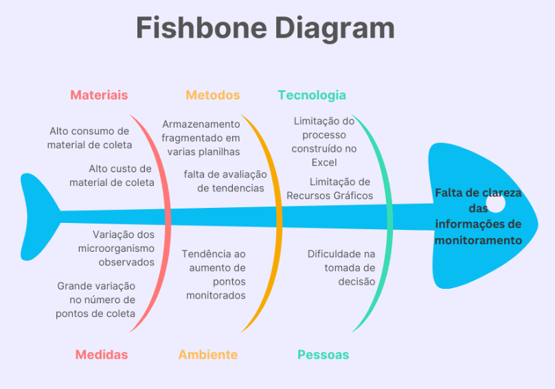

# CENÁRIO ATUAL DO CLIENTE E DO NEGÓCIO 

##  Histórico de Versão

| **Data** | **Versão** | **Descrição** | **Autor** |
| :------: | :--------: | :----------:  | :-------: |
| 18/11/2025| 1.0| Correções da avaliação | Guilherme Storch |

## Introdução ao Negócio e Contexto 

A empresa tida como cliente deste projeto é responsável pelo envase, engarrafamento e distribuição de bebidas em uma região específica do território nacional. É no contexto do processo de produção de grandes marcas do setor que surge a necessidade de padronização do processo e averiguação dos fatores de qualidade dos produtos fabricados. A área responsável pela garantia da qualidade em todos os aspectos da cadeia de produção desempenha um papel de extrema importância estratégica no processo industrial e atua em diversas frentes de controle, sendo uma delas a microbiológica. Esta área realiza um programa nas áreas sensíveis do processo de fabricação e envase de bebidas, que é foco de processos de auditoria. Recentemente, o programa passou por uma modificação. Neste cenário de modificações do programa, surge a necessidade de sistematizar o processo que, atualmente, ocorre por meio de registros em planilhas.

## Identificação da Oportunidade ou Problema 

As empresas do setor tiveram um período de adaptação para se familiarizar com um novo programa de monitoramento mi microbiológico lançado recentemente. Dada a urgência dessa readequação, atualmente há poucos sistemas que se propõem a realizar o registro de informações conforme os novos moldes estabelecidos. Além disso, o uso de planilhas para o registro de dados é predominante, em função da familiaridade dos executores do programa com essa ferramenta. Atualmente, não há produtos de software disponíveis no mercado que atendam integralmente aos novos padrões de processo estabelecidos pelo programa de monitoramento ambiental.  

Figura 1: Diagrama de Ishikawa

## Desafios do Projeto 

O volume de amostras coletadas mensalmente para atender o programa, somada às outras das muitas demandas internas da equipe operacional, impede o desenvolvimento de uma ferramenta interna para uma gestão de informações mais efeitva, ainda que por meio de ferramentas padrão já contradas pela empresa, onde o arcabouço tecnológico é majoritariamente Microsoft (Office 365). 

As iniciativas internas do núcleo de sistemas também não consegue surprir a demanda do setor para dar início a um projeto nessas condições, chegando a um momento crítico para a área, uma vez que os programas microbiológicos são alvo dos processos de auditoria (interna e externa) e recentemente, as solicitações dos mais diversos auditores tem apontado a necessidade de trazer as informações coletadas em formato de gráficos e dados que supram os pontos de avaliação do processo de audição.  

Como o processo atual de registro se resume a uma série de planilhas de levantamentos internos, há uma dificuldade da equipe em apresentar a análise temporal destas informações para os programas de auditoria, bem como realizar avaliações internas mais precisas levando em consideração os dados coletados. 

## Segmentação de Clientes 

São os possíveis perfis que utilizarão a ferramenta:  

- **Equipe operacional da microbiologia**: composta pelos assistentes, inspetores e líderes da área, formados majoritariamente por profissionais da área química ou da saúde; 

- **Auditores externos**: responsáveis por avaliar as condições do processo produtivo e averiguar se as informações coletadas pelo programa atendem as normas de segurança de alimentos e ao padrão do processo de produção estabelecido por órgãos superiores de verificação de qualidade dos produtos. 
