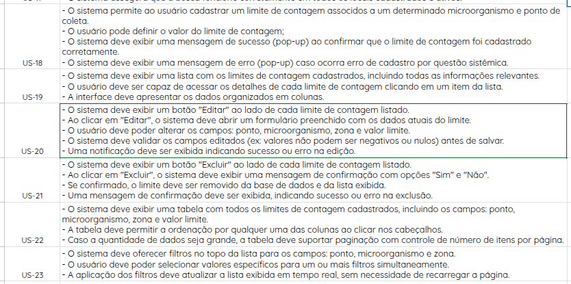
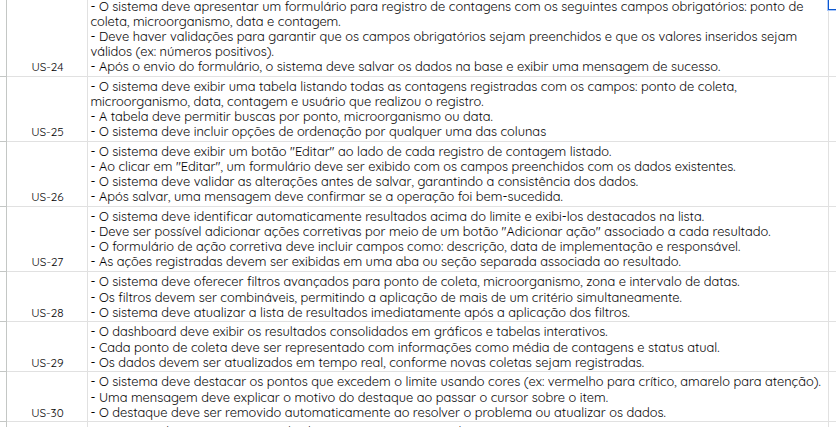
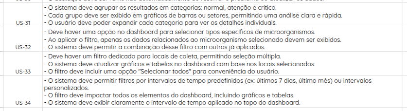

# Especificação dos Requisitos

## Critérios de Aceitação:
A declaração de histórias pode ser encontrada na página de [Backlog do produto](https://mdsreq-fga-unb.github.io/2024.2-T03-MicroData/visao_produto_projeto/backlog_produto/). Abaixo segue a relação de Histórias de usuário e critérios de aceitação:

## Cenários BDD's:

Abaixo estão os cartões e as confirmações das histórias selecionadas para o primeiro ciclo de desenvolvimento do projeto:
<!--
## Épico 1: ACESSO E LOGIN

### **US-01(CADASTRAR USUÁRIO):** Eu como usuário quero cadastrar uma conta para de minhas informações no sistema.

### Cenário 1: Cadastro Completo com Sucesso
- **Dado que** o usuário está na página de cadastro,
- **Quando** ele preencher todos os campos obrigatórios (Nome Completo, E-mail, Senha, Confirmação de Senha e Cargo) e clicar em "Cadastrar",
- **Então** o sistema deverá criar a conta e exibir a mensagem de sucesso: "Conta cadastrada com sucesso."

---

### Cenário 2: Validação de Campos Obrigatórios
- **Dado que** o usuário tenta cadastrar uma conta,
- **Quando** ele deixar de preencher um ou mais campos obrigatórios (Nome Completo, E-mail, Senha, Confirmação de Senha ou Cargo),
- **Então** o sistema deverá exibir mensagens de erro específicas indicando os campos que precisam ser preenchidos.

---

### Cenário 3: Verificação de Dados Duplicados
- **Dado que** o usuário tenta cadastrar uma conta com um e-mail já registrado,
- **Quando** ele clicar em "Cadastrar",
- **Então** o sistema deverá exibir a mensagem de erro: "E-mail já cadastrado. Tente fazer cadastro com outro e-mail ou faça login."

---

### Cenário 4: Validação do Formato de E-mail
- **Dado que** o usuário tenta cadastrar uma conta,
- **Quando** ele informar um endereço de e-mail que não segue o formato padrão (ex.: "nome@dominio.com"),
- **Então** o sistema deverá exibir a mensagem de erro: "Insira um e-mail válido."

---

### Cenário 5: Confirmação de E-mail
- **Dado que** o usuário tenta cadastrar uma conta,
- **Quando** ele informar um endereço de e-mail válido no formato,
- **Então** o sistema deverá enviar um e-mail de confirmação para validar a conta.

---

### Cenário 6: Confirmação de Senha
- **Dado que** o usuário tenta cadastrar uma conta,
- **Quando** ele preencher a senha e a confirmação de senha com valores diferentes,
- **Então** o sistema deverá exibir a mensagem de erro: "As senhas não coincidem."

---

### Cenário 7: Validação de Senha Segura
- **Dado que** o usuário tenta cadastrar uma conta,
- **Quando** ele informar uma senha que não atende aos critérios (ex.: pelo menos 8 caracteres, incluindo letras, números, letras maiúsculas e caracteres especiais),
- **Então** o sistema deverá exibir a mensagem de erro: "A senha deve conter no mínimo 8 caracteres, incluindo letras, números, letras maiúsculas e caracteres especiais."

---

### Cenário 8: Armazenamento Seguro
- **Dado que** o usuário cadastrou a conta com sucesso,
- **Quando** o sistema armazenar os dados,
- **Então** as senhas deverão ser criptografadas no banco de dados.

---

### **US-02(LOGAR USUÁRIO):** Eu como usuário quero realizar login na conta cadastrada para ter acesso aos recursos e funcionalidades da plataforma.

### Cenário 1: Login Bem-Sucedido
- **Dado que** o usuário está na página de login,
- **Quando** ele informar e-mail e senha corretos de uma conta existente,
- **Então** o sistema deverá:
  - Autenticar o usuário,
  - Redirecioná-lo para a página inicial.

---

### Cenário 2: Validação de Campos Obrigatórios
- **Dado que** o usuário está na página de login,
- **Quando** ele tentar fazer login sem preencher o campo de e-mail ou senha,
- **Então** o sistema deverá exibir uma mensagem de erro indicando o campo obrigatório ausente, como:
  - "O campo 'E-mail' é obrigatório."
  - "O campo 'Senha' é obrigatório."

---

### Cenário 3: Conta Inexistente
- **Dado que** o usuário tenta fazer login,
- **Quando** ele informar um e-mail que não está associado a nenhuma conta cadastrada,
- **Então** o sistema deverá exibir a mensagem de erro: "Nenhuma conta encontrada com este e-mail."

---

### Cenário 4: Senha Incorreta
- **Dado que** o usuário tenta fazer login,
- **Quando** ele informar um e-mail válido, mas uma senha incorreta,
- **Então** o sistema deverá exibir a mensagem de erro: "Senha incorreta. Tente novamente."

---

### Cenário 5: Logout
- **Dado que** o usuário está autenticado,
- **Quando** ele clicar no botão de logout,
- **Então** o sistema deverá:
  - Encerrar a sessão do usuário,
  - Redirecioná-lo para a página inicial de login.

---

### **US-03(VISUALIZAR USUÁRIO):** Eu como usuário quero visualizar meus dados cadastrais para verificar as informações imputadas no sistema.

### Cenário 1: Usuário Visualiza Seus Dados Cadastrais
- **Dado que** o usuário possui uma conta cadastrada e está autenticado na plataforma,
- **Quando** ele acessar a seção "Perfil" ou "Minha Conta",
- **Então** o sistema deverá exibir os seguintes dados cadastrais do usuário:
  - Nome Completo,
  - E-mail,
  - Cargo.

---

### Cenário 2: Botão para Editar Perfil
- **Dado que** o usuário está na seção "Perfil" ou "Minha Conta",
- **Quando** visualizar seus dados cadastrais,
- **Então** o sistema deverá :
- Exibir um botão "Editar Perfil",
- Ao clicar no botão, o sistema deverá redirecionar o usuário para a página de edição de perfil.

---

### **US-04(EDITAR USUÁRIO):** Eu como usuário poderia editar meus dados cadastrais para gerenciamento de erros de registro e atualização de informações.

### Cenário 1: Edição de Nome e Cargo com Sucesso
- **Dado que** o usuário esteja autenticado e na página de edição de perfil,
- **Quando** ele editar os campos "Nome Completo" e "Cargo" e clicar em "Salvar Alterações",
- **Então** o sistema deverá:
  - Solicitar a senha do usuário para confirmação,
  - Validar a senha fornecida,
  - Atualizar os dados cadastrados com sucesso,
  - Exibir a mensagem: "Dados atualizados com sucesso."

---

### Cenário 2: Editar a Senha
- **Dado que** o usuário esteja autenticado e na página de edição de senha,
- **Quando** ele preencher os campos "Nova Senha" e "Confirmar Nova Senha",
- **E** informar a senha antiga para validação,
- **Então** o sistema deverá:
  - Validar a senha antiga,
  - Garantir que "Nova Senha" e "Confirmar Nova Senha" sejam idênticas,
  - Atualizar a senha do usuário com sucesso,
  - Exibir a mensagem: "Senha atualizada com sucesso."

---

### **US-05(DESATIVAR USUÁRIO):** Eu como usuário poderia desativar o meu cadastro no sistema para os casos de desligamento com a empresa / área.

### Cenário 1: Solicitação de Desativação
- **Dado que** o usuário está autenticado no sistema,
- **Quando** ele acessar as configurações da conta e selecionar a opção "Desativar Conta",
- **Então** o sistema deverá:
  - Exibir uma mensagem de confirmação, como: "Tem certeza de que deseja desativar sua conta?",
  - Informar as consequências da desativação, como: "Você não terá mais acesso ao sistema após a desativação.",
  - Confirmar a solicitação do usuário,
  - Desativar a conta imediatamente,
  - Realizar o logout automático do usuário.

---

### Cenário 2: Bloqueio de Acesso
- **Dado que** a conta do usuário foi desativada,
- **Quando** ele tentar fazer login novamente,
- **Então** o sistema deverá:
  - Bloquear o acesso ao sistema,
  - Exibir a mensagem de erro: "Sua conta foi desativada."

---

### Cenário 3: Reativação de Conta Após Desativação
- **Dado que** a conta do usuário foi desativada,
- **Quando** ele quiser acessar o sistema novamente,
- **Então** o sistema deverá exigir que o usuário realize um novo cadastro para criar uma conta ativa.

---

### **US-06(RECUPERAR SENHA DE USUÁRIO):** Eu como usuário devo conseguir recuperar uma senha cadastrada para eventuais situações de esquecimento das informações de acesso.

### Cenário 1: Solicitação de Recuperação de Senha
- **Dado que** o usuário está na tela de login e não se lembra da senha,
- **Quando** ele clicar na opção "Esqueceu a senha?" e inserir o e-mail cadastrado,
- **Então** o sistema deverá:
  - Verificar se o e-mail está cadastrado,
  - Enviar um e-mail com instruções e um link para redefinir a senha,
  - Exibir a mensagem: "Um e-mail com instruções para redefinir sua senha foi enviado."

---

### Cenário 2: Tentativa de Recuperação com E-mail Não Cadastrado
- **Dado que** o usuário está na tela de recuperação de senha,
- **Quando** ele inserir um e-mail que não está cadastrado no sistema,
- **Então** o sistema deverá:
  - Exibir a mensagem: "E-mail não encontrado. Verifique as informações ou cadastre-se."

---

### Cenário 3: Redefinição de Senha por Link Enviado
- **Dado que** o usuário recebeu o link de redefinição de senha no e-mail,
- **Quando** ele clicar no link e acessar a página de redefinição,
- **Então** o sistema deverá:
  - Permitir que o usuário insira uma nova senha,
  - Validar os requisitos da nova senha (ex.: tamanho mínimo, letras maiúsculas, caracteres especiais, etc.),
  - Confirmar a alteração da senha,
  - Exibir a mensagem: "Sua senha foi redefinida com sucesso."

---

### Cenário 4: Expiração do Link de Redefinição
- **Dado que** o usuário recebeu o link de redefinição de senha,
- **Quando** ele tentar utilizá-lo após o período de validade (ex.: 24 horas),
- **Então** o sistema deverá:
  - Exibir a mensagem: "O link expirou. Solicite uma nova redefinição de senha."

---

## Épico 2: MICROORGANISMOS
-->

### **US-07:** 

### Cenário 1: O Usuário Realiza o Primeiro Cadastro de um Microorganismo no Banco
- **Dado que** um usuário deseja cadastrar um microorganismo no banco,
- **Quando** ele tenta realizar um registro,
- **Então** o sistema deverá:
  - Exigir o preenchimento dos seguintes campos obrigatórios:
    - Nome do microorganismo,
    - Descrição,
    - Limites de contagem,
    - Níveis de alerta.
  - Validar que todos os campos obrigatórios foram preenchidos corretamente,
  - Exibir a mensagem de sucesso: "Microorganismo cadastrado com sucesso."

---

### Cenário 2: O Usuário Tenta Realizar o Cadastro de um Microorganismo Já Cadastrado

- **Dado que** um usuário tenta cadastrar um microorganismo que já está registrado no banco,
- **Quando** ele tenta realizar o registro,
- **Então** o sistema deverá:
  - Verificar se já existe um registro com o mesmo nome no banco de dados,
  - Exibir uma mensagem de notificação: "Este microorganismo já está cadastrado no sistema. Verifique os dados ou atualize o registro existente."

---

### **US-08:** 

### Cenário 1: O Usuário Acessa os Registros de Microorganismos
- **Dado que** um usuário deseja acessar os registros de microorganismos,
- **Quando** ele acessar a página de informações,
- **Então** o sistema deverá:
  - Exibir uma listagem contendo os microorganismos cadastrados no banco,
  - Apresentar os seguintes campos principais para cada microorganismo:
    - Nome do microorganismo,
    - Descrição,
    - Limites de contagem,
    - Níveis de alerta.

---

### **US-09:**

### Cenário 1: O Usuário Tenta Editar uma Informação de um Microorganismo Cadastrado
- **Dado que** um usuário acessa a informação de um microorganismo,
- **Quando** ele tenta realizar uma modificação nas informações,
- **Então** o sistema deverá:
  - Exibir um alerta de confirmação sobre a edição de dados, como: "Tem certeza de que deseja editar as informações deste microorganismo?",
  - Permitir que o usuário confirme ou cancele a ação,
  - Caso confirmado, salvar as alterações e exibir a mensagem: "Informações atualizadas com sucesso."

---

### Cenário 2: O Usuário Tenta Desativar um Microorganismo
- **Dado que** um usuário acessa a informação de um microorganismo,
- **Quando** ele tenta desativar o microorganismo observado,
- **Então** o sistema deverá:
  - Exibir um alerta de confirmação sobre a desativação, como: "Tem certeza de que deseja desativar este microorganismo? Esta ação não pode ser desfeita.",
  - Após a confirmação, desativar o microorganismo e exibir a mensagem: "Microorganismo desativado com sucesso.",
  - Bloquear futuras edições nas informações do microorganismo desativado.

---

### **US-10:**

### Cenário 1: O Usuário é Notificado Sobre a Desativação do Microorganismo
- **Dado que** o usuário acessa os registros de microorganismos observados,
- **Quando** o usuário realiza a desativação,
- **Então** o sistema deverá:
  - Notificar o usuário sobre a ação realizada com a mensagem: "Tem certeza que deseja realizar essa ação? A desativação deste registro implica informar para o sistema que este microorganismo não é mais observado pelo programa."

---

### Cenário 2: O Usuário Desativa um Microorganismo Ativo
- **Dado que** o usuário acessa os registros de microorganismos observados,
- **Quando** o usuário realiza a desativação,
- **Então** o sistema deverá proceder com a desativação do microorganismo observado pelo sistema.

---

### **US-11:**

### Cenário 1: O Usuário Insere os Níveis de Alerta do Microorganismo no Sistema
- **Dado que** o usuário cadastra um microorganismo,
- **Quando** tenta realizar um registro,
- **Então** o sistema deverá:
  - Permitir que ele insira os níveis de alerta de contagem do microorganismo conforme os possíveis limites de contagem.

---

### **US-12:**

### Cenário 1: O Usuário Busca um Registro de Microorganismo Específico
- **Dado que** o usuário acessa os registros de microorganismos observados,
- **Quando** realiza uma busca,
- **Então** o sistema deverá:
  - Apresentar o registro informado na base de dados.

---

### **US-13:**

### Cenário 1:  usuário cadastra um ponto de coleta pela primeira vez
- **Dado** que o usuário cadastra um local de coleta
- **Quando** acessa a página de registro 
- **Então** o sistema deve apresentar um formulário para preenchimento das informações de: sala, área, Local/ Processo, Método (Campo de Descrição), Frequência (Semanal, Quinzenal, Mensal), Momento da coleta (Campo de descrição), Zoneamento por proximidade (Zona 1, Zona 2, Zona 3 ou Zona 4), Zoneamento Higiênico (Alto risco, Médio risco ou Baixo risco), Ativo? (Boolean, preenchido automaticamente no mmento do registro), Data de cadastro (preenchido automaticamente no mmento do registro)
- **E** receber uma mensagem de confirmação de registro caso a requisição tenha sucesso.
---
### Cenário 2: O usuário cadastra um ponto de coleta e ocorre falha no registro
- **Dado** que o usuário cadastra um local de coleta
- **Quando** acessa a página de registro e ocorre falha na requisição 
- **Então** o sistema deve apresentar uma mensagem de erro informando a falha da requisição.
---
### Cenário 3: O usuário cadastra um ponto anteriormente registrado
- **Dado** o usuário cadastra um local de coleta anteriormente registrado 
- **Quando** tenta concluir o registro 
- **Então** o sistema deve apresentar uma notificação informando que o registro já existe na base de dados.
---

### **US-14:** 

### Cenário 1: O usuário acessa a página de registros para procurar por um ponto em específico
- **Dado** que um usuário acessa a página de registros
- **Quando** tenta buscar por um ponto de coleta
- **Então** o sistema deve apresentar uma listagem com todos os pontos registrados ativos até então.

---

### **US-15**

### Cenário 1: Edição Bem-Sucedida
- **Dado que** o usuário esteja autenticado e na página de edição de locais de coleta avaliados,
- **Quando** realiza alterações nos dados do local e clicar em "Salvar",
- **Então** o sistema deverá:
  - Salvar as alterações realizadas,
  - Exibir a mensagem de confirmação: "Local de coleta atualizado com sucesso".

---

### Cenário 2: Dados Inválidos na Edição
- **Dado que** o usuário esteja autenticado e na página de edição de locais de coleta,
- **Quando** inserir dados inválidos (ex.: Local inexistente) e clicar em "Salvar",
- **Então** o sistema deverá:
  - Exibir uma mensagem de erro específica para o campo inválido,
  - Não salvar as alterações.

---

### Cenário 3: Cancelamento da Edição
- **Dado que** o usuário esteja autenticado e na página de edição de locais de coleta avaliados,
- **Quando** realiza alterações nos dados e clicar no botão "Cancelar",
- **Então** o sistema deverá descartar as alterações realizadas e retornar o usuário para a página anterior sem modificar os dados existentes.

---

### **US-16:** 

### Cenário 1: Desativação Bem-Sucedida
- **Dado que** o usuário esteja autenticado e na página de desativar local de coleta,
- **Quando** ele selecionar um local de coleta e clicar no botão "Desativar",
- **Então** o sistema deverá:
  - Atualizar o status do local de coleta para "Desativado",
  - Exibir a mensagem de confirmação: "Local de coleta desativado com sucesso".

---

### Cenário 2: Cancelar a Desativação
- **Dado que** o usuário esteja autenticado e na página de desativar um local de coleta avaliado,
- **Quando** ele clicar no botão "Cancelar" antes de confirmar a desativação,
- **Então** o sistema deverá:
  - Manter o status do local de coleta como "Ativo",
  - Retornar à página anterior sem efetuar nenhuma alteração.

---

### **US-17:** 

### Cenário 1: O Usuário Busca um Registro de Local de Coleta Específico
- **Dado que** o usuário acessa os registros de locais de coleta observados,
- **Quando** realiza uma busca,
- **Então** o sistema deverá apresentar o registro informado na base de dados.

---

### **US-18** 

### Cenário 1: Registro Bem-Sucedido da Contagem
- **Dado que** o usuário está na página de adicionar resultados do monitoramento,
- **Quando** preencher os campos obrigatórios (ex.: Data, Local de Coleta, Contagem de Microrganismos) e clicar em "Salvar",
- **Então** o sistema deverá:
  - Registrar a contagem,
  - Exibir a mensagem de sucesso: "Contagem registrada com sucesso."

---

### Cenário 2: Falha no Preenchimento de Campos Obrigatórios
- **Dado que** o usuário tenta adicionar uma contagem de microrganismos,
- **Quando** deixar de preencher algum campo obrigatório,
- **Então** o sistema deverá exibir mensagens de erro específicas indicando os campos que precisam ser preenchidos.

---

### Cenário 3: Tentativa de Registrar Contagem Duplicada
- **Dado que** o usuário já registrou uma contagem para o mesmo Local e Data,
- **Quando** tentar adicionar uma nova contagem com essas mesmas informações,
- **Então** o sistema deverá exibir a mensagem de erro: "Já existe uma contagem registrada para este local e data."

---

### Cenário 4: Validação de Valores Inválidos
- **Dado que** o usuário está preenchendo o campo de contagem de microrganismos,
- **Quando** informar um valor fora do intervalo permitido ou inválido (ex.: texto, números negativos),
- **Então** o sistema deverá exibir a mensagem de erro: "Informe uma contagem válida."

---

### **US-19:** 

### Cenário 1: Listagem Bem-Sucedida
- **Dado que** o usuário acessa a página de resultados do monitoramento,
- **Quando** clicar na aba "Contagens Registradas",
- **Então** o sistema deverá exibir uma lista contendo os registros de contagem de microrganismos com campos como:
  - Data,
  - Local de Coleta,
  - Microrganismo,
  - Contagem.

---

### Cenário 2: Nenhum Registro Encontrado
- **Dado que** o usuário acessa a página de resultados do monitoramento,
- **Quando** não houver registros disponíveis,
- **Então** o sistema deverá exibir a mensagem: "Nenhuma contagem de microrganismos registrada até o momento."

---

### Cenário 3: Paginação da Listagem
- **Dado que** o usuário acessa a página de contagens registradas,
- **Quando** houver mais registros do que o limite exibido por página,
- **Então** o sistema deverá oferecer opções para navegar entre as páginas de resultados.

---

### Cenário 4: Ordenação Personalizada
- **Dado que** o usuário acessa a lista de contagens registradas,
- **Quando** selecionar um critério de ordenação (ex.: Data, Local ou Contagem),
- **Então** o sistema deverá exibir os registros ordenados conforme o critério selecionado.

---

### **US-20:** 

### Cenário 1: Edição Bem-Sucedida
- **Dado que** o usuário acessa o registro de uma contagem existente,
- **Quando** modificar os campos necessários e clicar em "Salvar",
- **Então** o sistema deverá:
  - Atualizar o registro,
  - Exibir a mensagem: "Registro atualizado com sucesso."

---

### Cenário 2: Falha ao Salvar Alterações
- **Dado que** o usuário tenta editar um registro,
- **Quando** ocorrer uma falha na atualização dos dados,
- **Então** o sistema deverá exibir a mensagem de erro: "Erro ao salvar as alterações. Tente novamente mais tarde."

---

### Cenário 3: Cancelamento da Edição
- **Dado que** o usuário acessa a página de edição de um registro,
- **Quando** clicar em "Cancelar" antes de salvar as alterações,
- **Então** o sistema deverá:
  - Descartar as alterações,
  - Retornar para a página de visualização do registro sem realizar nenhuma modificação.

---

<!--
### **US-21:** Eu como usuário quero deletar um limite de contagem cadastrado para melhor controle e gestão de informações
------------------------------------------------------------------------

---

### **US-22(FILTRAR UM RESULTADO DE COLETA):** Eu como usuário, quero aplicar filtros aos resultados de coleta microbiológica para que eu possa localizar informações específicas de forma eficiente e realizar análises mais detalhadas.

### Cenário 1: Filtro Aplicado com Sucesso
- **Dado que** o usuário acessa a página de resultados do monitoramento,
- **Quando** selecionar critérios como Data ou Local de Coleta e clicar em "Filtrar",
- **Então** o sistema deverá exibir apenas os registros que correspondem aos critérios selecionados.

---

### Cenário 2: Nenhum Resultado Encontrado
- **Dado que** o usuário aplica um filtro na página de resultados do monitoramento,
- **Quando** não houver registros que atendam aos critérios selecionados,
- **Então** o sistema deverá exibir a mensagem: "Nenhum resultado encontrado para os filtros aplicados."

---

### Cenário 3: Aplicação de Múltiplos Filtros
- **Dado que** o usuário deseja localizar resultados específicos,
- **Quando** combinar vários critérios de filtro (ex.: Local, Data e Contagem maior que um valor específico),
- **Então** o sistema deverá exibir os registros que atendem a todos os critérios selecionados.

---

### Cenário 4: Limpeza de Filtros Aplicados
- **Dado que** o usuário aplicou filtros na página de resultados do monitoramento,
- **Quando** clicar em "Limpar Filtros",
- **Então** o sistema deverá:
  - Remover todos os filtros,
  - Exibir novamente a lista completa de registros.

---

### **US-21(INSERIR AÇÕES CORRETIVAS):** Eu como usuário, quero inserir as ações corretivas para os resultados acima do limite de contagem de microrganismos para o registro de ações de controle mais efetivo e um processo de tomada de decisão mais eficiente.

### Cenário 1: Adição de Ação Corretiva com Sucesso
- **Dado que** o usuário acessa um registro com resultados acima do limite de contagem,
- **Quando** preencher a descrição da ação corretiva e clicar em "Salvar",
- **Então** o sistema deverá:
  - Registrar a ação corretiva,
  - Exibir a mensagem: "Ação corretiva registrada com sucesso."

---

### Cenário 2: Falha no Preenchimento de Informações
- **Dado que** o usuário tenta adicionar uma ação corretiva,
- **Quando** não preencher o campo obrigatório de descrição,
- **Então** o sistema deverá exibir a mensagem de erro: "Descrição da ação corretiva é obrigatória."

---

### Cenário 3: Atualização de uma Ação Corretiva Existente
- **Dado que** o usuário acessa uma ação corretiva já registrada,
- **Quando** modificar a descrição ou os detalhes da ação e clicar em "Salvar",
- **Então** o sistema deverá:
  - Atualizar as informações da ação corretiva,
  - Exibir a mensagem: "Ação corretiva atualizada com sucesso."

---

---

## Épico 5: DASHBOARD

### **US-23(VISUALIZAR RESULTADOS DOS PONTOS):** Como usuário, quero visualizar no dashboard os resultados de coleta para cada ponto, a fim de acompanhar a situação microbiológica de forma consolidada.

### Cenário 1: O Usuário Quer Visualizar o Resultado de Coleta dos Pontos Avaliados
- **Dado que** o usuário acessa o dashboard,
- **Quando** quer acessar os resultados da coleta em determinado ponto,
- **Então** o sistema deverá apresentar todas as informações de coleta no ponto desejado pelo usuário.

---

### Cenário 2: O Ponto Avaliado Não Está com os Resultados Disponíveis
- **Dado que** o usuário acessa o dashboard,
- **Quando** quer acessar os resultados da coleta em determinado ponto, mas não possui resultados naquele momento,
- **Então** o sistema não deverá apresentar o ponto em questão como opção válida para visualização de resultados.

---

### **US-24(VISUALIZAR PONTOS ACIMA DO LIMITE):** Como usuário, quero que o dashboard destaque os pontos que excederem o limite de contagem, para priorizar ações corretivas.

### Cenário 1: O Usuário Deseja Visualizar Pontos Acima do Limite de Contagem no Dashboard
- **Dado que** o usuário acessa o dashboard,
- **Quando** um ou mais valores excedem o limite de contagem pré-definido,
- **Então** o dashboard deverá destacar visualmente esses pontos (por exemplo, com cores, ícones ou marcadores).

---

### Cenário 2: Ação Corretiva Sugerida para Pontos Acima do Limite
- **Dado que** o usuário acessa o dashboard,
- **Quando** o usuário seleciona um ponto acima do limite de contagem,
- **Então** o sistema deverá apresentar a ação corretiva cadastrada baseada no registro apresentado.

---

### **US-25(VISUALIZAR RESULTADOS POR NÍVEL DE ALERTA):** Como usuário, quero visualizar os resultados agrupados por nível de alerta (normal, atenção, crítico), para facilitar a análise dos dados críticos.

### Cenário 1: O Usuário Deseja Visualizar Resultados de Acordo com os Níveis de Alerta
- **Dado que** o usuário acessa o dashboard,
- **Quando** visualiza os dados no dashboard,
- **Então** o sistema deverá exibir os resultados agrupados por nível de alerta, diferenciados por cores ou indicadores distintos.

---

### **US-26(FILTRAR RESULTADOS POR MICROORGANISMO):** Como usuário, quero filtrar no dashboard os resultados por tipo de microorganismo, para avaliar padrões de contagem específicos.

### Cenário 1: O Usuário Filtra os Resultados por Microorganismo
- **Dado que** o usuário acessa o dashboard,
- **Quando** filtra os resultados por microorganismo,
- **Então** o sistema deverá:
  - Organizar a base de dados de referência,
  - Apresentar todas as informações de coleta do microorganismo escolhido para análise das contagens registradas.

---

### **US-27(FILTRAR RESULTADOS POR LOCAL):** Como usuário, quero filtrar no dashboard os resultados por local de coleta, para analisar os dados de uma área específica.

### Cenário 1: O Usuário Filtra os Resultados por Local de Coleta
- **Dado que** o usuário acessa o dashboard,
- **Quando** filtra os resultados por local de coleta,
- **Então** o sistema deverá:
  - Organizar a base de dados de referência,
  - Apresentar todas as informações de coleta do ponto escolhido para análise das contagens registradas.

---

### **US-28(FILTRAR RESULTADOS POR PERÍODO):** Como usuário, quero filtrar os resultados no dashboard por período de tempo, para entender as variações ao longo de diferentes intervalos.

### Cenário 1: O Usuário Informa a Data Referencial de Início
- **Dado que** o usuário acessa o dashboard,
- **Quando** informa uma data de referência para início da filtragem,
- **Então** o sistema deverá:
  - Organizar a base de dados de referência,
  - Apresentar todas as informações de registros a partir da data informada em diante para análise das contagens registradas.

---

### Cenário 2: O Usuário Informa a Data Referencial de Fim
- **Dado que** o usuário acessa o dashboard,
- **Quando** informa uma data de referência para o final da filtragem,
- **Então** o sistema deverá:
  - Organizar a base de dados de referência,
  - Apresentar todas as informações de registros até a data informada para análise das contagens registradas.

---

### Cenário 3: O Usuário Filtra os Resultados por Intervalo de Tempo
- **Dado que** o usuário acessa o dashboard,
- **Quando** filtra os resultados por intervalo de tempo (data de início e fim),
- **Então** o sistema deverá:
  - Organizar a base de dados de referência,
  - Apresentar todas as informações no intervalo de tempo escolhido para análise das contagens registradas.

---

### Cenário 4: Limpeza de Filtros Aplicados
- **Dado que** o usuário aplicou filtros na página de resultados do monitoramento,
- **Quando** clicar em "Limpar Filtros",
- **Então** o sistema deverá:
  - Remover todos os filtros,
  - Exibir novamente a lista completa de registros.

-->

##  Histórico de Versão

| **Data** | **Versão** | **Descrição** | **Autor** |
| :--------: | :--------: | :--------:  | :--------: | 
|      15/12/2024      |      1.0      |      Criação do documento       |     Breno Fernandes     |
|      23/12/2024      |      1.1      |      Adicionando especificações de requisitos       |     Breno Fernandes, Guilherme, Rafael, Renan, Breno Lucena e João     |
|      26/12/2024      |      1.1      |      Adicionando nomes aos RFs nas especificações       |     Breno Fernandes, Guilherme, Rafael, Renan, Breno Lucena e João     |
